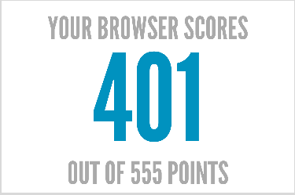
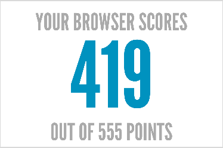

# WebViewLoader

basic iOS app to load some URL with UIWebView or with WkWebView

### UIWebView score

### WkWebView score

You can edit the default url in [ViewController.swift](./WebViewLoader/ViewController.swift)
